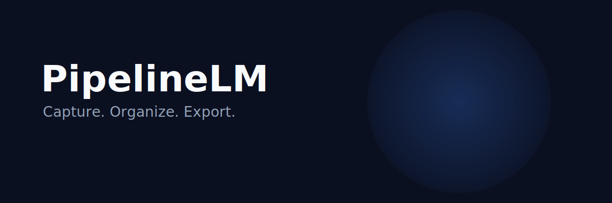

# PipelineLM

<p align="center">
  
</p>

<p align="center">
  
</p>

<h3 align="center">Capture. Organize. Export.</h3>

<p align="center">Chrome extension power-suite for Google NotebookLM.</p>

<p align="center">
  <a href="https://lumenhelixlab.github.io/PipelineLM/">Launch Page</a>
  <span> · </span>
  <a href="https://github.com/lumenhelixlab/PipelineLM">GitHub</a>
  <span> · </span>
  <a href="https://lumenhelix.com">LumenHelix</a>
</p>

---

PipelineLM is the Chrome extension power-suite for Google NotebookLM. It injects a side panel with prompt studio, bulk source management, smart folders, fleet scanner, and one-click exports — all processed client-side with zero external API calls.

## Why PipelineLM

- **Stay private.** All processing happens in the browser; no data leaves your machine.
- **Work faster.** Context-menu additions and bulk operations cut notebook management time.
- **Own your prompts.** Saved prompt libraries and exports travel with your extension data.

## Quick start

### macOS / Linux

```bash
git clone https://github.com/lumenhelixlab/PipelineLM.git
cd PipelineLM
npm install
npm run build
# Load dist/ as an unpacked extension in chrome://extensions
```

### Windows (PowerShell)

```powershell
git clone https://github.com/lumenhelixlab/PipelineLM.git
Set-Location PipelineLM
npm install
npm run build
# Load dist/ as an unpacked extension in chrome://extensions
```

### Windows (Git Bash / WSL)

```bash
git clone https://github.com/lumenhelixlab/PipelineLM.git
cd PipelineLM
npm install
npm run build
# Load dist/ as an unpacked extension in chrome://extensions
```

> Tested on Windows 11, macOS Sonoma, Ubuntu 22.04/24.04, and modern mobile browsers.

## Features

| Feature | What it gives you |
|---------|-------------------|
| Prompt studio | Save, organize, and reuse prompts across notebooks with topic-aware suggestions. |
| Bulk source management | Add pages, links, and selected text as sources directly from the context menu. |
| Smart folders & fleet scanner | Organize notebooks with folders and tags, then scan your fleet for status and updates. |
| One-click exports | Export studio items and notes to PDF, Markdown, and other formats without leaving the browser. |

## Architecture

```
manifest.json
  ->  sidepanel.html  ->  content.js
  ->  ai-analyzer.js  ->  studio-config.js
  ->  scripts/  ->  build, validation, packaging helpers
```

## Development

```bash
# Install dependencies and build
npm install
npm run dev

# Or build once and load dist/ unpacked
npm run build
```

## Roadmap

- [ ] Firefox and Chromium-family port
- [ ] Syncable prompt and folder backups
- [ ] Inline study mode with spaced-repetition cards

## License

Released under the MIT License.

---

<p align="center">
  <sub>PipelineLM is a <a href="https://lumenhelix.com">LumenHelix</a> project — Applied Symbolic Dynamics & Reversible Computation.</sub>
</p>
